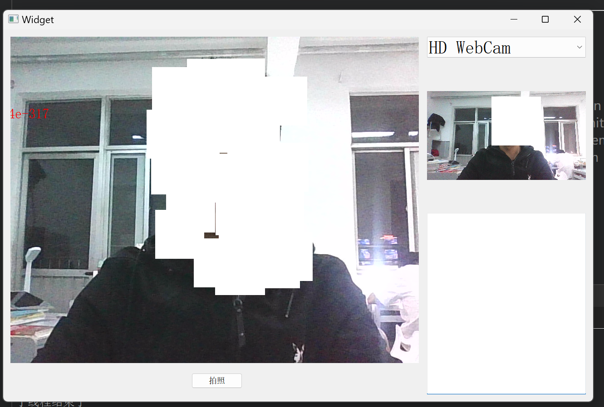

# faceRecognition

#### 介绍
本项目是基于Qt5的人脸检测应用，支持多摄像头，集成百度人脸检测API，通过HTTPS安全请求，解析人脸特征信
息，并采用多线程优化性能。

#### 实现的功能

- 实时人脸检测：系统能够实时检测并识别来自多个摄像头输入的视频流中的人脸；
- 高效图像处理：通过多线程技术优化了图像处理逻辑，确保在处理大量数据时系统的响应速度和稳定性；
- 安全通信：实现了HTTPS请求的SSL配置，保障了数据传输的安全性。

#### 软件架构
Qt、HTTPS、Json、多线程

#### 使用说明

* 我的Qt版本是QT5.15.2的, 此项目不支持QT6

* 此项目需要`HTTPS`通信,  所以需要QT能用https 

  QT用不了https的, 可以参考这篇博客:https://blog.csdn.net/qq_32355021/article/details/124089942 , openssl-1.1.1w-win64: https://pan.baidu.com/s/1kK4zvQiU4JkPDxuDTgojhg?pwd=cdef

​	
